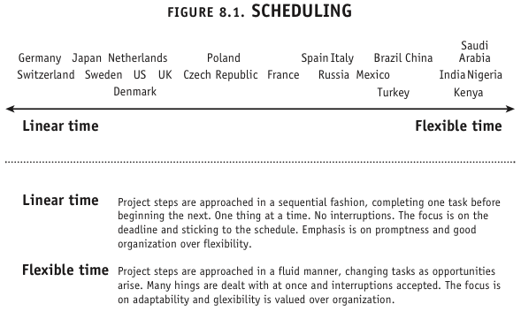
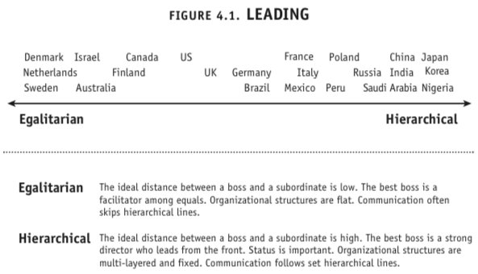
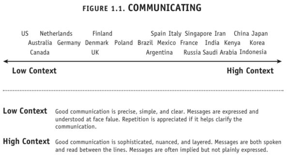
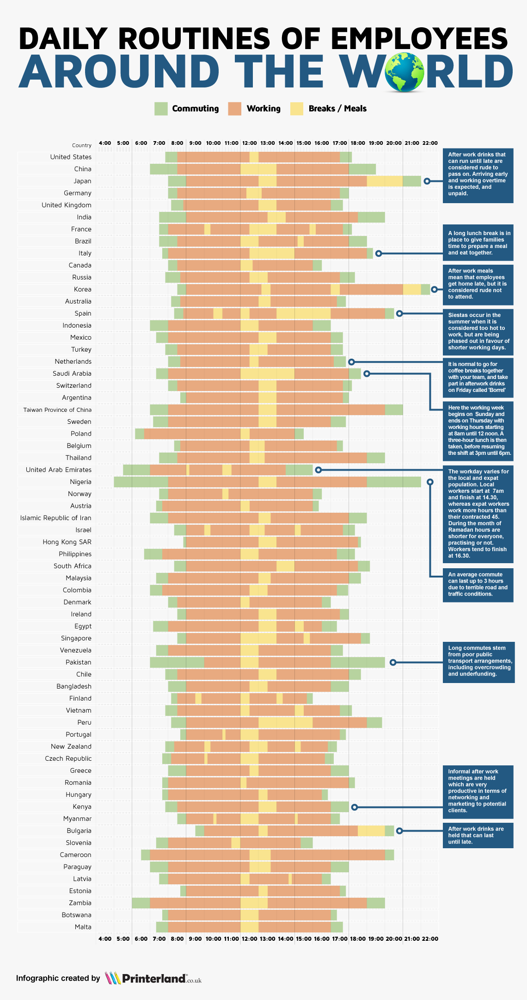
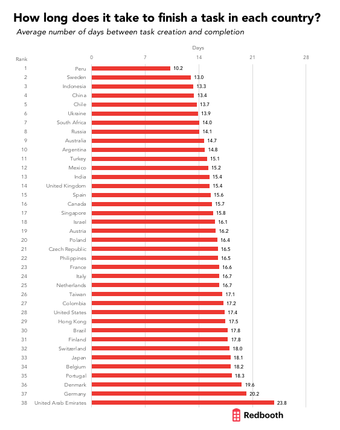

# Cultural Diversity
 
There are many things to consider when inviting someone, whether it's mentors or students for Fab Academy or for another project, from the global community to join you in your Fab Lab. Or for that matter, when you're collaborating at a distance or visiting other fab labs.

The global Fab network has led to a connection of international people in a extraordinary way. In the past, we would collaborate with people from our own or nearby countries, whereas now we are talking on a daily basis to many people from different countries, using a variety of platforms as well as in person. Accordingly, we need new skills to do this.

But most of us don't know much about how local culture impacts on our global interaction. Even those who have travelled and have lived overseas often have few strategies for dealing with the cross-cultural complexity that affects day-to-day interactions between diverse cultures.

The richness of our cultural diversity is not something that we should lose or try to 'fix' by making it bland and uniform - each of us brings our own unique perspective, and fab labs must be spaces where these differences are understood and are celebrated as being beneficial to our overall development. How can we change the world if everyone isn't involved? It's just another form of colonisation, if everybody has to become like one particular culture to succeed in the fab network.

It's easy to say 'Oh, they're never on time - how do they ever get anything done?' *OR* 'They're so rigid - why can't they relax and just get on with it?' If we don't spend some time working together to understand these differences, then statements like: 'I'll never work with anyone from that country again.' or 'That person is impossible to work with!' become normal and shut down further opportunities for understanding.

A great book for helping us understand this is the [Culture Map](https://www.erinmeyer.com/book/) by Erin Meyer. 

An example of her thinking around this is the differences in attitudes to scheduling. 

You can see that countries are spread all across the spectrum - obviously the ones at either end are going to have to work hard to understand each other, but, as Erin Meyer points out, countries closer together are relatively different. In the above example, Polish people might find French people too relaxed but Russians might find the French too rigid.

The following example showing differences in hierarchies is also quite illuminating. It becomes interesting when you think that often the countries who are most inflexible about time are the least hierarchical in their leadership qualities. 

I highly recommend reading this book and discussing it frequently with others. I have read it a number of times in the last eighteen months, each time discovering new things that are relevant to my everyday fabbing experience. I have lived in other countries and I have worked with many people from other countries within New Zealand. During my time as an educator, I have focused on ensuring that all students are engaged, and now that I am working within the global fab network and hosting Fab Academy, this focus is even more important. 

The suggestions below come from my experience as a host and as a visitor. The best advice that I can offer is:

***Be explicit | Don't assume anything*** 

Erin Meyer calls it Low Context communication - assume that your guest has absolutely no context for understanding this new environment. Being explicit about particular things in your own culture is difficult because you inhabit it and take these things for granted. If you are from a high context culture it is also embarrassing, as it feels like you're treating the person like a child. It's important to ask for feedback from your guests so that you can improve your information & process for next time - each person will notice different things. 

'Don't assume anything' is easy to say, but not easy to do. This works for both sides. Think about all the stereotypes you know about your country and look at the culture map images above. Again, it is easy to think that a country close to you on a particular culture map doesn't need as much explanation as one further from you, but that's not true - subtle differences can be just as challenging. The real examples below show when explicit communication will help the people in this situation.

- In some cultures, it is respectful to avert your eyes when your teacher is talking to you, whereas in others a student makes eye contact to indicate that they're paying attention. If the teacher expects eye contact, but the student is looking away, the teacher might assume that they aren't paying attention. 
- In some cultures, it is respectful to ask questions of the teacher individually after class, whereas in others it is expected that questions will be asked during class. If a student waits until after class to ask questions, the teacher might assume that the student didn't understand the class at all.
- In some cultures, if you are teaching adults, it is considered too formal to use a title when addressing your teacher, whereas in others it is important at any age to use a title when speaking to your teacher. If a teacher from an informal culture introduces themselves by their first name, the student from the formal culture might assume that the teacher is unqualified.

## Language

English is often our only shared language, however each of us understands it from a different cultural perspective. And then there are our accents. Americans have been known to ask New Zealanders what language we speak usually. We mumble a lot. And actually I found out recently that there is a name for how we speak English. It's called [non-rhotic](https://en.wikipedia.org/wiki/Rhoticity_in_English) Basically, we drop our 'R' and a couple of other consonants a lot. An example sentence: I went for a ride in his car. This is how it sounds when I’m saying it to another New Zealander: I wen’ fo’ri’ in ‘is cah. The T, H and the R are implied, and some words are run together or totally ignored. Due to working overseas, having students from a variety of cultures and working within the fab network, I have worked to speak more clearly. This now means that now New Zealanders ask where I'm from...

If the language commonly spoken in your Lab is not a shared language, your guest will miss a lot of information in the early weeks because they haven't yet absorbed the culture of your Lab. They will suddenly realise that everyone is gone and wonder why, having missed an entire conversation next to them while they were busy concentrating on something else. They can also misintrepret the tone of conversations. 

Pay particular attention to facing each other when you're talking - we gain a lot of information from faces and body language, which are very important when getting used to accents and/or language. 

***never underestimate the value of drawing***

You may think that your guest understands a conversation, but using a whiteboard or large sheet of paper as you discuss things can be super-helpful. If both of you agree that the conversation matches what is drawn, then it is a successful communication, and it is a map of the conversation for future reference. I often say - do you remember when I said... and a puzzled look will come over someone's face. If I re-phrase it and point to a part of the 'drawing', that person's face clears and the conversation continues.

## Work

I provide two graphs with the caveat that these should be viewed with an open mind. They are interesting because they show real difference in cultural attitudes towards task completion and normal working hours. Please take the time to read the articles associated with these graphs. 

From [Silicon Republic](https://www.siliconrepublic.com/careers/hardworking-countries-research)

 

and [Redbooth](https://redbooth.com/blog/productivity-by-country)

I also encourage you to check out [If it were my home](https://www.ifitweremyhome.com/) which allows you to compare your country with the one your visitor is from.

## Pre Arrival and Arrival Orientation - things to consider as a host

What do you think that your guest needs to know to prepare for their visit? Can you point them to useful websites, or summarise those useful websites so that the information is more accessible for your guest. It's just as easy to find misinformation on the internet as it is to find useful information. Be careful not to overload the person with information all at once, unless they request it. We now have a few documents that we share with our guests and then we meet a week later to discuss these as well as encouraging questions via one of the communication platforms we use. This includes the employment contract.

If we use Maslow's Hierarchy of Needs as a good starting point again, then we start at the bottom layer. This is a new environment for this person. 

**Physiological needs:** Tell your guest what information you would normally provide and ask them what they would like. Information about where you think good areas to live are and average costs, transport to and from the Lab, what sort of food is everyday, whether you can drink the public water supply or must buy it, appropriate clothing, climate. Yes, your guest can look this all up themselves, but it's about clarifying the information and tailoring it for them - being hospitable and answering the questions before they ask them. It is also helping you both get to know each other and helping them to imagine living there and begin to look forward to it. What will their average day consist of? 

**Safety needs:** It can be embarrassing, because you love your country, but you need to be honest. Can you leave your bags unattended in a cafe when you go to the counter to order coffee? Should you lock your doors and windows all of the time? Are public displays of affection legal? How does your visitor access healthcare? What is the emeergency phone number in your country? Where is the First Aid cabinet? Some of this will be covered prior to arriving but it's important to cover it again as part of the orientation.

**Love & Belonging:** Hospitality is different in every country, and we all like to think that we make people feel at home. However, there are many confusing differences - some cultures will give a guest lots of space to adjust (potentially leaving a guest feeling neglected), others will have a full orientation programme organised (potentially leaving a guest feeling overwhelmed and exhausted). Tell your guest what you plan to do and ask them what they prefer. Welcome them, introduce them to the fabbers in the Lab. Show them where the bathrooms are! When does lunch happen (see the daily routines graph above) and is it a two hour group event that occurs offsite or is it a 1/2 hour individual event in the Lab? Do not expect your guest to be absolutely comfortable instantly - each Lab is set up differently, has different systems, equipment and processes. 

